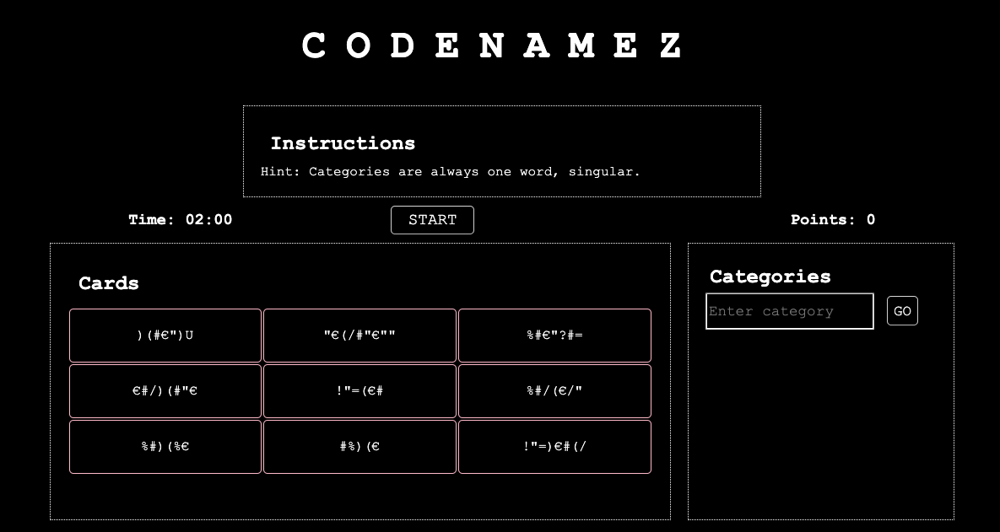

# CODENAMEZ

[Codenamez](https://mialav.github.io/codenamez/) is a Javascript game based on the popular board game [Codenames](https://en.wikipedia.org/wiki/Codenames_(board_game)).

## Game play

To play the game, the player must click start. This reveals the first set of words on the 9 cards and starts the timer.

The player must then enter categories that fit the words being shown – for categories that fit at least two words, the player earns a point per card (e.g. 2 words = 2 points, 3 words = 3 points). Categories that only match one current word do not earn any points.

If the player gets stuck, a new set of words can be shuffled by clicking "Next". The score is kept through each new iteration until the timer is finished.

## Feedback?

Please send feedback about the game to mialavanti@gmail.com.

